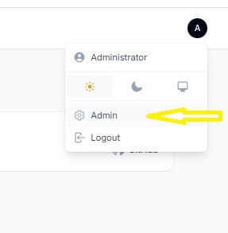

<h1>Laravel 11 with Sail and Filament - Multi-user Support</h1>

<strong>Description</strong>

This project is a Laravel application designed with multi-user support, featuring two main roles: <strong>Administrator</strong> and <strong>User</strong>. It uses <strong>Laravel Sail</strong> for a Docker-based development environment and <strong>Filament</strong> as the administrative panel. The system includes robust user management features, allowing for differentiated access levels based on user roles.

<strong>Features</strong>

<ul>
<li><strong>Multi-user system</strong> with role-based access control:</li>
<ul>
<li><strong>Administrator</strong>: Full access to the system, including user and permissions management.</li>
<li><strong>User</strong>: Limited access, based on predefined permissions.</li>
</ul>
<li><strong>Filament Admin Panel</strong>: A powerful and customizable admin interface for managing the application's data and users.</li>
<li><strong>Sail Integration</strong>: Provides a streamlined local development environment using Docker, ensuring consistency across development setups.</li>
<li><strong>Database Migrations</strong>: Pre-configured migrations for setting up database tables, including user roles and permissions.</li>
<li><strong>RESTful API Structure</strong>: Built with clean and extendable API endpoints.</li>
</ul>

<strong>Setup Instructions</strong>

<ol>
<li>Clone the repository:</li>
</ol>

git clone <a href="mailto:git@github.com:amroberto/laravel11sail_filament.git">git@github.com:amroberto/laravel11sail_filament.git</a>

cd laravel11sail_filament

&nbsp;

<ol start="2">
<li>Install dependencies:</li>
</ol>

composer install

&nbsp;

<ol start="3">
<li>Run migrations and seed the database:</li>
</ol>

php artisan migrate &ndash;seed

&nbsp;

<ol start="4">
<li>Start Laravel Sail</li>
</ol>

./vendor/bin/sail up

&nbsp;

<ol start="5">
<li>Access the application at http://localhost in your browser.</li>
</ol>

&nbsp;

<strong>Access Information</strong>

You can access the application using the following credentials:

<ul>
<li><strong>Admin Login</strong>:</li>
<ul>
<li><strong>Email</strong>: admin@admin.com</li>
<li><strong>Password</strong>: password</li>
</ul>
<li><strong>User Login</strong>:</li>
<ul>
<li><strong>Email</strong>: user@user.com</li>
<li><strong>Password</strong>: password</li>
</ul>
</ul>

To log in, navigate to /app and use one of the provided credentials to access the system as an admin or a user.

<strong>Accessing the Admin Panel</strong>

Once logged in as an administrator, you can access the <strong>Admin Panel</strong> through the user menu in the top right corner of the screen. Here's how to navigate:.

<strong>User Roles</strong>

The system distinguishes between two types of users:

<ol>
<li><strong>Administrators</strong>: Have access to all features of the platform, including creating and managing users, handling administrative settings, and overseeing the operation of the system.</li>
<li><strong>Regular Users</strong>: Have restricted access, typically limited to interacting with specific modules based on their role.</li>
</ol>

<strong>Support the Project</strong>

If you find this project helpful, please consider supporting its development:

<ul>
<li><a title="Donate to Developer" href="https://www.paypal.com/donate/buttons/manage/JN5P9TWEHXVTS" target="_blank">Donate via PayPal</a></li>
</ul>

Your support is greatly appreciated and helps keep the project alive!

